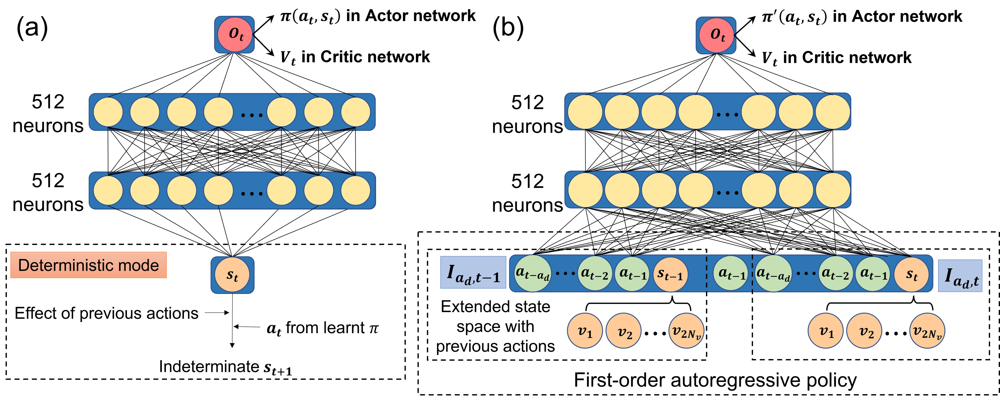

<div align="center">
<!-- Title: -->
  <h1>ARP-DMDP-PPO</h1>

This repository contains the code corresponding to our manuscript, Yiqian Mao (毛逸谦), Shan Zhong, and Hujun Yin , "Active flow control using deep reinforcement learning with time delays in Markov decision process and autoregressive policy", Physics of Fluids 34, 053602 (2022)

This paper is availbale at https://doi-org.manchester.idm.oclc.org/10.1063/5.0086871.
</div>

In this work, a Markov decision process (MDP) with time delays is introduced to model and quantify the action delays in the environment in a deep reinforcement learning (DRL) process due to the time difference between control actuation and flow response along with the use of a first-order autoregressive policy (ARP). This hybrid DRL method (ARP-DMDP-PPO) is applied to control the vortex-shedding process from a two-dimensional circular cylinder using four synthetic jet actuators at a freestream Reynolds number of 400.

The DRL procedure is presented as below:

<div align="center"></div>

The Proximal Policy Optimization (PPO) was adopted as the reinforcement learning algorithms. The network architectures of standard PPO and ARP-DMDP-PPO are shown as below:



This work is based on the work of <a href="https://doi-org.manchester.idm.oclc.org/10.1063/1.5116415">Rabault et al.</a> and
<a href="https://doi-org.manchester.idm.oclc.org/10.1063/5.0006492">Tang et al.</a>, and the reader can also refer to the [open source
code](https://github.com/jerabaul29/Cylinder2DFlowControlDRLParallel) and (https://github.com/thw1021/Cylinder2DFlowControlGeneral).

If you use this work for your research, please consider citing our work:
```
@article{mao2022active,
  title={Active flow control using deep reinforcement learning with time delays in Markov decision process and autoregressive policy},
  author={Mao, Yiqian and Zhong, Shan and Yin, Hujun},
  journal={Physics of Fluids},
  volume={34},
  number={5},
  pages={053602},
  year={2022},
  publisher={AIP Publishing LLC}
}
```

# Contact and Support
yiqian.mao@manchester.ac.uk (Yiqian Mao)
